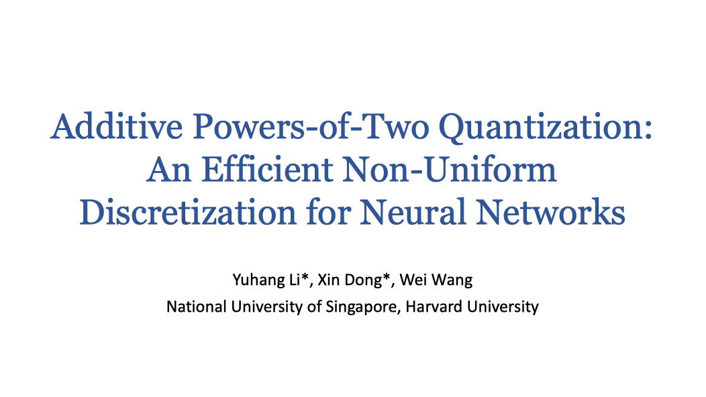

# APoT Quantization

```latex
@article{li2019additive,
  title={Additive Powers-of-Two Quantization: A Non-uniform Discretization for Neural Networks},
  author={Li, Yuhang and Dong, Xin and Wang, Wei},
  journal={arXiv preprint arXiv:1909.13144},
  year={2019}
}
```

This repo contains the code and data of the following paper accepeted by [ICLR 2020](https://openreview.net/group?id=ICLR.cc/2020/Conference)

> [Additive Power-of-Two Quantization: An Efficient Non-uniform Discretization For Neural Networks](https://openreview.net/pdf?id=BkgXT24tDS)


## Change Log

+ May 16 2020: New quantization function, checkpoints for ImageNet, and slides for brief introduction.

## Installation

### Prerequisites

Pytorch 1.1.0 with CUDA

### Dataset Preparation

* The models are trained using internal framework and we only release the checkpoints as well as the logs, please prepare the ImageNet validation and training dataset, we use [official example code](https://github.com/pytorch/examples/blob/master/imagenet/main.py) here to load data. 
* The CIFAR10 dataset can be download automatically (update soon). 

## ImageNet

`models.quant_layer.py` contains the configuration for quantization. In particular, you can specify them in the class `QuantConv2d`:

```python
class QuantConv2d(nn.Conv2d):
    """Generates quantized convolutional layers.

    args:
        bit(int): bitwidth for the quantization,
        power(bool): (A)PoT or Uniform quantization
        additive(float): Use additive or vanilla PoT quantization

    procedure:
        1. determine if the bitwidth is illegal
        2. if using PoT quantization, then build projection set. (For 2-bit weights quantization, PoT = Uniform)
        3. generate the clipping thresholds

    forward:
        1. if bit = 32(full precision), call normal convolution
        2. if not, first normalize the weights and then quantize the weights and activations
    """

    def __init__(self, in_channels, out_channels, kernel_size, stride=1, padding=0, dilation=1, groups=1, bias=False, bit=5, power=True, additive=True):
        super(QuantConv2d, self).__init__(in_channels, out_channels, kernel_size, stride, padding, dilation, groups, bias)
        self.layer_type = 'QuantConv2d'
        assert bit == 32 or (bit >= 2 and bit <= 8), 'Bitwidth Not Supported!'
        self.bit = bit
        if self.bit != 32:
            self.power = power
            if power:
                if self.bit > 2:
                    self.proj_set_weight = build_power_value(B=self.bit-1, additive=additive)
                self.proj_set_act = build_power_value(B=self.bit, additive=additive)
            self.act_alpha = torch.nn.Parameter(torch.tensor(6.0))
            self.weight_alpha = torch.nn.Parameter(torch.tensor(3.0))
```

Here, `self.bit`  controls the bitwidth;  `power=True` means we use PoT or APoT (use `additive` to specify). `build_power_value` construct the levels set Q^a(1, b) with parameter `bit` and `additive`. If `power=False`, the conv layer will adopt uniform quantization. 

To train a 5-bit model, just run main.py:

```bash
python main.py -a resnet18 --bit 5
```

Progressive initialization requires checkpoint of higher bitwidth. For example

```bash
python main.py -a resnet18 --bit 4 --pretrained checkpoint/res18_5best.pth.tar
```

We provide a function `show_params()` to print the clipping parameter in both weights and activations

###Hyper-params

Models are initialized with pre-trained models, please use `pretrained=True` to intialize the model. We use the following hyper-params for all parameters, including the clipping thresholds.

Learning rate is scaled by 0.1 at epoch 30,60,90.

### Results and Checkpoints

Checkpoints are released in [Google Drive](https://drive.google.com/open?id=1iIZ1tsaFLSuaujPbnyLutxDZuG31i5kD).

|   Model   | Precision | Hyper-Params                      | Accuracy | Checkpoints                                                  |
| :-------: | --------- | --------------------------------- | -------- | ------------------------------------------------------------ |
| ResNet-18 | 5-bit     | batch1k_lr0.01_wd0.0001_100epoch  | -        | Updating                                                     |
| ResNet-18 | 4-bit     | batch1k_lr0.01_wd0.0001_100epoch  | 70.74    | Updating                                                     |
| ResNet-18 | 3-bit     | batch1k_lr0.01_wd0.0001_100epoch  | 69.79    | [res18_3bit](https://drive.google.com/open?id=1zJX3tbAbBXYxpP8QYx3dvMQoiGrCO9dc) |
| ResNet-18 | 2-bit     | batch1k_lr0.01_wd0.00002_100epoch | -        | Updating                                                     |
| ResNet-34 | 5-bit     | batch1k_lr0.1_wd0.0001_100epoch   | 74.26    | [res34_5bit](https://drive.google.com/open?id=1tXIV03PNu8QpSF2fhrR3werhBB34Sb42) |
| ResNet-34 | 4-bit     | batch1k_lr0.1_wd0.0001_100epoch   | -        | Updating                                                     |

### Compared with Uniform Quantization

To be updated

### Training and Validation Curve

To be updated

```bash
cd $PATH-TO-THIS-PROJECT/ImageNet/events
tensorboard --logdir 'res18' --port 6006
```


#### Hyper-parameteres Exploration

To be updated

## CIFAR10

(CIFAR10 codes will be updated soon.)

The training code is inspired by [pytorch-cifar-code](https://github.com/junyuseu/pytorch-cifar-models) from [junyuseu](https://github.com/junyuseu).

The dataset can be downloaded automatically using torchvision. We provide the shell script to progressively train full precision, 4, 3, and 2 bit models. For example, `train_res20.sh` :

``` bash
#!/usr/bin/env bash
python main.py --arch res20 --bit 32 -id 0,1 --wd 5e-4
python main.py --arch res20 --bit 4 -id 0,1 --wd 1e-4  --lr 4e-2 \
        --init result/res20_32bit/model_best.pth.tar
python main.py --arch res20 --bit 3 -id 0,1 --wd 1e-4  --lr 4e-2 \
        --init result/res20_4bit/model_best.pth.tar
python main.py --arch res20 --bit 2 -id 0,1 --wd 3e-5  --lr 4e-2 \
        --init result/res20_3bit/model_best.pth.tar
```

The checkpoint models for CIFAR10 are released: 

| Model | Precision      | Accuracy  | Checkpoints                                                  |
| :---: | -------------- | --------- | ------------------------------------------------------------ |
| Res20 | Full Precision | 92.96     | [Res20_32bit](https://github.com/yhhhli/APoT_Quantization/tree/master/CIFAR10/result/res20_32bit) |
| Res20 | 4-bit          | **92.45** | [Res20_4bit](https://github.com/yhhhli/APoT_Quantization/tree/master/CIFAR10/result/res20_4bit) |
| Res20 | 3-bit          | **92.49** | [Res20_3bit](https://github.com/yhhhli/APoT_Quantization/tree/master/CIFAR10/result/res20_3bit) |
| Res20 | 2-bit          | **90.96** | [Res20_2bit](https://github.com/yhhhli/APoT_Quantization/tree/master/CIFAR10/result/res20_2bit) |
| Res56 | Full Precision | 94.46     | [Res56_32bit](https://github.com/yhhhli/APoT_Quantization/tree/master/CIFAR10/result/res56_32bit) |
| Res56 | 4-bit          | **93.93** | [Res56_4bit](https://github.com/yhhhli/APoT_Quantization/tree/master/CIFAR10/result/res56_4bit) |
| Res56 | 3-bit          | **93.77** | [Res56_3bit](https://github.com/yhhhli/APoT_Quantization/tree/master/CIFAR10/result/res56_3bit) |
| Res56 | 2-bit          | **93.05** | [Res56_2bit](https://github.com/yhhhli/APoT_Quantization/tree/master/CIFAR10/result/res56_2bit) |

To evluate the models, you can run 

```bash
python main.py -e --init result/res20_3bit/model_best.pth.tar -e -id 0 --bit 3
```

And you will get the output of accuracy and the value of clipping threshold in weights & acts:

```bash
Test: [0/100]   Time 0.221 (0.221)      Loss 0.2144 (0.2144)    Prec 96.000% (96.000%)
 * Prec 92.510%
clipping threshold weight alpha: 1.569000, activation alpha: 1.438000
clipping threshold weight alpha: 1.278000, activation alpha: 0.966000
clipping threshold weight alpha: 1.607000, activation alpha: 1.293000
clipping threshold weight alpha: 1.426000, activation alpha: 1.055000
clipping threshold weight alpha: 1.364000, activation alpha: 1.720000
clipping threshold weight alpha: 1.511000, activation alpha: 1.434000
clipping threshold weight alpha: 1.600000, activation alpha: 2.204000
clipping threshold weight alpha: 1.552000, activation alpha: 1.530000
clipping threshold weight alpha: 0.934000, activation alpha: 1.939000
clipping threshold weight alpha: 1.427000, activation alpha: 2.232000
clipping threshold weight alpha: 1.463000, activation alpha: 1.371000
clipping threshold weight alpha: 1.440000, activation alpha: 2.432000
clipping threshold weight alpha: 1.560000, activation alpha: 1.475000
clipping threshold weight alpha: 1.605000, activation alpha: 2.462000
clipping threshold weight alpha: 1.436000, activation alpha: 1.619000
clipping threshold weight alpha: 1.292000, activation alpha: 2.147000
clipping threshold weight alpha: 1.423000, activation alpha: 2.329000
clipping threshold weight alpha: 1.428000, activation alpha: 1.551000
clipping threshold weight alpha: 1.322000, activation alpha: 2.574000
clipping threshold weight alpha: 1.687000, activation alpha: 1.314000
```

## [[Slides]](figs/ICLR_Apot.pdf)



